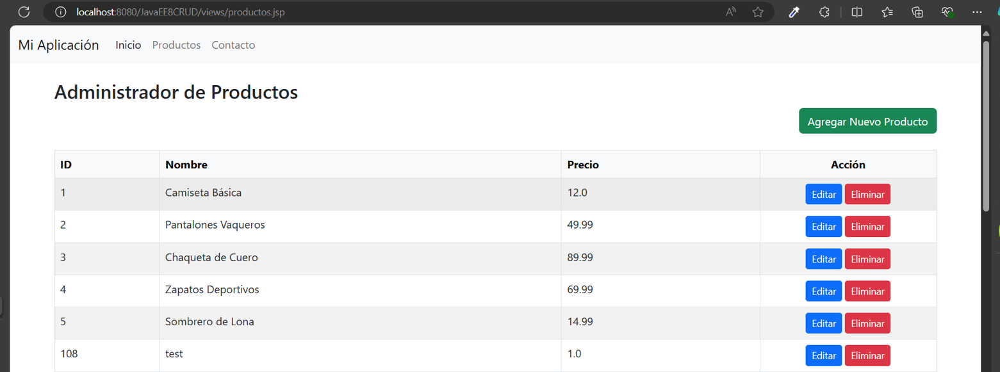

APLICACION DE PEDIDOS  
APLIACCION CON GESTION DE CLIENTES, PRODUCTOS Y PEDIDOS

LISTADO DE PRODUCTOS
 

 FORMULARIO DE CREACION Y EDICION DE PRODUCTOS
 

5-	Recopilación de requerimientos técnicos  
-	Entorno de Desarrollo: Netbeans, jdk 1.8, JAVA EE 8, GLASSFISH 5  
-	Base de datos: ORACLE 18C EXPRESS, SQLDEVELOPER. 
-	Lenguaje de programación: java EE, JAVASCRIPT, JQUERY   
-	ESTILOS: BOOTSTRAP  

